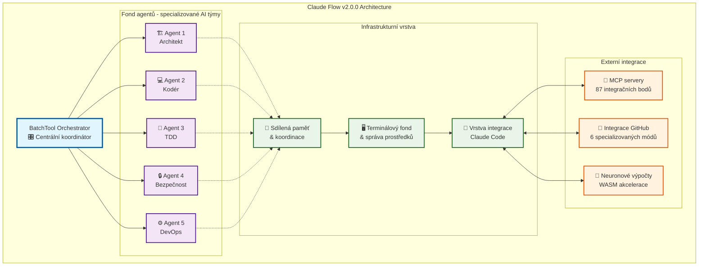

# Claude Flow - Kompletní Česká Příručka pro AI-Driven Development

[](https://claude.ai)
[](https://github.com)
[](https://github.com/ruvnet/claude-flow)
[](LICENSE)

> **🤖 Upozornění na původ**: Tento dokument byl kompletně vytvořen umělou inteligencí Claude 4 Sonnet od Anthropic na základě systematické analýzy dostupných primárních zdrojů, komunitních diskuzí a technické dokumentace. Obsah prošel AI kontrolami s 90-95% odhadovanou přesností, ale nebyl fyzicky ověřen člověkem a slouží pouze jako komunitní dokumentace a neoficiální překlad. Před použitím nejen v produkčním prostředí doporučuji vlastní ověření všech postupů.

> **⚠️ Varování ohledně alpha technologie**: Claude Flow v2.0.0 je rychle se vyvíjející alpha technologie. Některé funkce a příkazy se mohou změnit. Dokument byl vytvořen na základě dostupných zdrojů z července 2025.

> **🔍 Rozlišení projektů**: Claude Flow je komunitní orchestrační rozšíření vytvořené ruvnet pro oficiální Claude Code CLI. Není to oficiální Anthropic produkt, ale rozšiřuje funkce oficiálního Claude Code o pokročilé možnosti koordinace více agentů.

## Oficiální odkazy

- **Claude Flow (komunitní)**: [github.com/ruvnet/claude-flow](https://github.com/ruvnet/claude-flow)
- **Claude Code (oficiální Anthropic)**: [github.com/anthropics/claude-code](https://github.com/anthropics/claude-code)
- **Claude Code NPM balíček**: [npmjs.com/package/@anthropic-ai/claude-code](https://www.npmjs.com/package/@anthropic-ai/claude-code)
- **Claude Flow NPM balíček**: [npmjs.com/package/claude-flow](https://www.npmjs.com/package/claude-flow)
- **Anthropic Claude Code dokumentace**: [docs.anthropic.com/claude-code](https://docs.anthropic.com/en/docs/claude-code/overview)
- **Model Context Protocol**: [modelcontextprotocol.io](https://modelcontextprotocol.io)

## Obsah

1. [Úvod a přehled](#úvod-a-přehled)
2. [Požadavky na systém](#požadavky-na-systém)
3. [Instalace](#instalace)
4. [Základní konfigurace](#základní-konfigurace)
5. [První kroky](#první-kroky)
6. [Metodologie SPARC](#metodologie-sparc)
7. [Orchestrace rojů](#orchestrace-rojů)
8. [Pokročilé funkce](#pokročilé-funkce)
9. [Systém automatizace](#systém-automatizace)
10. [Řešení problémů](#řešení-problémů)
11. [Praktické příklady](#praktické-příklady)
12. [Reference příkazů](#reference-příkazů)
13. [Komunitní zkušenosti](#komunitní-zkušenosti)
14. [Zdroje a reference](#zdroje-a-reference)

---

## Úvod a přehled

### Co je Claude Flow?

Claude Flow v2.0.0 je revoluční orchestrační platforma pro agenty umělé inteligence, která radikálně mění způsob práce s Claude Code. Představuje komplexní systém pro koordinaci více agentů AI současně, správu složitých postupů práce a budování sofistikovaných aplikací s vývojem řízeným umělou inteligencí.

Claude Flow funguje jako "rojová inteligence" - hierarchický systém podobný úlu, kde centrální orchestrátor koordinuje specializované agenty AI. Každý agent má svou expertní oblast (architekt, programátor, tester, bezpečnostní analytik, DevOps specialista) a společně vytvářejí efektivní vývojový tým.

### Klíčové výhody

**Paralelní provádění**: Až 10 agentů současně pomocí technologie BatchTool pro dramatické zrychlení vývoje.

**Inteligentní koordinace**: Automatická distribuce úkolů a vyvažování zátěže mezi agenty na základě jejich specializace.

**Sdílení paměti**: Perzistentní banka znalostí napříč všemi agenty, která umožňuje kontinuitu a učení.

**Sledování v reálném čase**: Živé řídicí panely pro sledování stavu agentů a průběhu projektů.

**17 specializovaných módů**: Od architektury přes kódování až po bezpečnostní audity - vše pod jednou střechou.

### Architektura systému



**Vysvětlení architektury:**

**BatchTool Orchestrator** funguje jako centrální mozek systému, který koordinuje všechny agenty a distribuuje úkoly na základě jejich specializace a aktuální dostupnosti.

**Fond agentů** obsahuje specializované agenty AI, kde každý agent má svou expertní oblast. Architekt navrhuje systémové architektury, kodér implementuje kód, TDD specialista vytváří testy, bezpečnostní agent provádí bezpečnostní audity a DevOps agent zvládá nasazení a infrastrukturu.

**Sdílená paměť** poskytuje perzistentní úložiště znalostí, které umožňuje agentům sdílet informace napříč sezeními a učit se z předchozích zkušeností. Koordinační komponenta zajišťuje, že agenti efektivně spolupracují bez konfliktů.

**Terminálový fond** spravuje systémové prostředky a poskytuje jednotné rozhraní pro všechny agenty k přístupu k terminálu a souborovému systému.

**Vrstva integrace Claude Code** tvoří most mezi Claude Flow a základní technologií Claude Code, poskytující bezproblémovou komunikaci a přístup k nástrojům.

**Externí integrace** rozšiřují možnosti systému prostřednictvím MCP serverů s 87 dostupnými integračními body pro různé externí nástroje a služby, specializované režimy integrace GitHub pro správu repozitářů a možnosti neuronových výpočtů s WASM akcelerací pro pokročilé operace AI.

### Verze a varianty

**Claude Code (oficiální Anthropic)**: Základní asistent AI pro kódování (`@anthropic-ai/claude-code`) dostupný přes NPM. Toto je oficiální Anthropic produkt běžící v terminálu.

**Claude Flow v1.x (komunitní)**: Stabilní produkční verze orchestračního rozšíření vytvořeného ruvnet, která rozšiřuje Claude Code o základní funkce koordinace více agentů.

**Claude Flow v2.0.0 Alpha (experimentální)**: Pokročilá alpha verze s neuronovými výpočty, architekturou podobnou úlu a 87 nástroji MCP. Rychle se vyvíjející technologie určená pro testování a zpětnou vazbu.

**Vzájemný vztah**: Claude Flow funguje jako inteligentní orchestrační vrstva nad Claude Code, přidávající rojovou inteligenci a koordinaci více agentů k základnímu nástroji Claude Code CLI.

---

## Požadavky na systém

### Minimální požadavky

**Operační systém**: Windows 10+, macOS 10.15+, Linux (Ubuntu 18.04+)

**Node.js**: Verze 18.0.0 nebo vyšší (doporučeno 20.x)

**NPM**: Verze 8.0.0 nebo vyšší

**RAM**: Minimálně 4GB (doporučeno 8GB pro operace s roji)

**Disk**: 2GB volného místa

### Doporučené požadavky

**Procesor**: Vícecore procesor (4+ jader) pro paralelní zpracování

**RAM**: 16GB+ pro rozsáhlé operace s roji

**SSD**: Pro rychlé vstupně-výstupní operace

**Internetové připojení**: Stabilní připojení pro komunikaci s Claude API

### Předpoklad Claude Code

Claude Flow vyžaduje nainstalovaný a nakonfigurovaný Claude Code jako svou základní platformu. Claude Code je oficiální Anthropic CLI nástroj, který poskytuje základní funkcionalitu kódování s AI.

**Instalace Claude Code** (pokud ještě nemáte):
```bash
npm install -g @anthropic-ai/claude-code
```

**Požadavky pro Claude Flow**:
- Platný klíč Claude API nebo účet Anthropic
- Funkční instalace Claude Code (ověřte pomocí `claude --version`)
- Správně nakonfigurovaný `.claude/settings.json` v domovském adresáři

**Ověření nastavení Claude Code**:
```bash
# Test funkcionality Claude Code
claude --version

# Test přihlášení
claude auth login

# Test základních funkcí
claude --help
```

Teprve po funkčním Claude Code můžete pokračovat s instalací Claude Flow, který tento základ rozšíří o pokročilé orchestrační schopnosti.

---

## Instalace

### Metoda 1: NPX (doporučeno pro začátečníky)

NPX metoda je nejjednodušší způsob, jak začít s Claude Flow. Nevyžaduje instalaci a vždy použije nejnovější verzi.

```bash
# Jednoduchá inicializace s prostředím SPARC
npx claude-flow@latest init --sparc

# Spuštění s webovým rozhraním
./claude-flow start --ui --port 3000

# Použití příkazů SPARC
./claude-flow sparc "build a REST API"
```

**Výhody NPX metody:**
- Žádná instalace není potřeba
- Vždy nejnovější verze
- Rychlý start pro testování
- Ideální pro jednorázové projekty

### Metoda 2: Globální instalace NPM

Pro častější použití Claude Flow v různých projektech.

```bash
# Instalace globálně
npm install -g claude-flow

# Inicializace kdekoli
claude-flow init --sparc

# Přímé použití
claude-flow start --ui

# Ověření instalace
claude-flow --version
```

### Metoda 3: Instalace do konkrétního projektu

Pro integraci Claude Flow do konkrétního projektu.

```bash
# Přidání do projektu
npm install claude-flow --save-dev

# Inicializace v projektu
npx claude-flow init --sparc

# Použití s místním skriptem
./claude-flow start --ui

# Přidání do scripts v package.json
echo '"claude-flow": "./claude-flow"' >> package.json
```

### Metoda 4: Alpha verze

Pro přístup k nejnovějším funkcím (experimentální).

```bash
# Instalace alpha verze
npm install -g claude-flow@alpha

# Nebo pomocí npx
npx claude-flow@alpha init --force

# Test systému automatizace
npx claude-flow@alpha hooks --help
```

### Metoda 5: Instalace pro Deno

Pro uživatele preferující běhové prostředí Deno.

```bash
# Instalace pomocí Deno
deno install --allow-all --name claude-flow \
  https://raw.githubusercontent.com/ruvnet/claude-code-flow/main/src/cli/index.ts

# Ověření instalace
claude-flow --help
```

### Metoda 6: Sestavení ze zdrojového kódu

Pro vývojáře nebo pokročilé uživatele.

```bash
# Klonování repozitáře
git clone https://github.com/ruvnet/claude-flow.git
cd claude-flow

# Instalace závislostí
npm install

# Sestavení projektu
npm run build

# Propojení pro lokální vývoj
npm link

# Test
claude-flow --version
```

### Ověření instalace

Po jakékoli metodě instalace ověřte správnou funkčnost:

```bash
# Kontrola verze
claude-flow --version

# Kontrola stavu systému
claude-flow status

# Test základních funkcí
claude-flow --help
```

---

## Základní konfigurace

### Inicializace projektu

Proces inicializace vytvoří kompletní prostředí Claude Flow:

```bash
# Plná inicializace s prostředím SPARC
npx claude-flow@latest init --sparc
```

Tento příkaz vytvoří následující strukturu:

```
projekt/
├── .claude/
│   ├── settings.json          # Hlavní konfigurace
│   └── commands/              # Vlastní příkazy
├── .roomodes                  # 17 předkonfigurovaných módů SPARC
├── CLAUDE.md                  # Pokyny pro Claude Code
├── claude-flow               # Místní skript
└── swarms/                   # Konfigurace rojů
    ├── development/
    ├── testing/
    └── production/
```

### Konfigurace settings.json

Soubor `.claude/settings.json` je srdcem konfigurace Claude Flow:

```json
{
  "providers": {
    "anthropic": {
      "maxTokens": 200000,
      "model": "claude-3-5-sonnet-20241022"
    }
  },
  "tools": {
    "computer": "*",
    "textEditor": "*",
    "bash": "*"
  },
  "rules": [
    "Always save important findings to memory using memory_store",
    "Use batch operations when coordinating multiple agents",
    "Prefer parallel execution for independent tasks"
  ],
  "timeoutMs": 300000,
  "outputMaxTokens": 500000,
  "hooks": {
    "PreToolUse": [
      {
        "matcher": "Edit < /dev/null | MultiEdit",
        "hooks": [{
          "type": "command",
          "command": "npx claude-flow hooks pre-edit --file \"${CLAUDE_FLOW_FILE}\" --auto-assign-agents",
          "blocking": false
        }]
      }
    ],
    "PostToolUse": [
      {
        "matcher": "Edit|MultiEdit|Write",
        "hooks": [{
          "type": "command",
          "command": "npx claude-flow hooks post-edit --file \"${CLAUDE_FLOW_FILE}\" --format-code --update-memory"
        }]
      }
    ]
  }
}
```

### Konfigurace MCP serverů

Claude Flow automaticky konfiguruje servery Model Context Protocol:

```bash
# Kontrola stavu MCP
./claude-flow mcp status

# Ruční konfigurace MCP
./claude-flow mcp setup --auto-permissions --87-tools
```

### Správa konfigurace

```bash
# Zobrazení aktuální konfigurace
claude-flow config show

# Nastavení konkrétních hodnot
claude-flow config set orchestrator.maxConcurrentAgents 10
claude-flow config set timeoutMs 600000

# Návrat na výchozí hodnoty
claude-flow config init --force

# Export konfigurace
claude-flow config export --output my-config.json

# Import konfigurace
claude-flow config import --file my-config.json
```

---

## První kroky

### Základní spuštění

Po úspěšné instalaci a konfiguraci můžete začít používat Claude Flow:

```bash
# Spuštění orchestračního systému
./claude-flow start

# Spuštění s webovým rozhraním
./claude-flow start --ui --port 3000

# Spuštění na pozadí
./claude-flow start --daemon
```

### Kontrola stavu systému

Před začátkem práce vždy zkontrolujte stav systému:

```bash
# Kompletní přehled systému
./claude-flow status

# Stav jednotlivých komponent
./claude-flow agent list
./claude-flow memory stats
./claude-flow mcp status
```

### Váš první agent

Vytvoření a práce s prvním agentem:

```bash
# Vytvoření výzkumného agenta
./claude-flow agent spawn researcher --name "Research Assistant"

# Ověření, že agent je aktivní
./claude-flow agent list

# Získání informací o agentovi
./claude-flow agent info <agent-id>
```

### Váš první úkol

Vytvoření a spuštění základního úkolu:

```bash
# Vytvoření výzkumného úkolu
./claude-flow task create research \
  "Analyze current trends in AI development tools" \
  --priority high \
  --estimated-duration 2h

# Kontrola stavu úkolu
./claude-flow task list

# Sledování průběhu úkolu
./claude-flow task monitor --follow
```

### Základní postup práce SPARC

SPARC (Specification, Pseudocode, Architecture, Refinement, Completion) je strukturovaná metodologie pro vývoj:

```bash
# Základní příkazy SPARC
./claude-flow sparc "research best practices for microservices"
./claude-flow sparc run architect "design scalable architecture"
./claude-flow sparc run code "implement user service"
./claude-flow sparc run tdd "create comprehensive test suite"
```

### Správa paměti

Claude Flow používá perzistentní paměť pro sdílení znalostí:

```bash
# Uložení informací do paměti
./claude-flow memory store requirements "User auth with JWT"
./claude-flow memory store architecture "Microservice design patterns"

# Dotazování na uloženou paměť
./claude-flow memory query auth
./claude-flow memory query --filter "microservice" --recent

# Export znalostí
./claude-flow memory export --filter "research-results" --output findings.json
```

---

## Metodologie SPARC

### Co je SPARC?

SPARC je strukturovaná metodologie pro vývoj řízený umělou inteligencí, která rozděluje komplexní vývojové úkoly do pěti fází:

**S**pecification: Definice požadavků a specifikací  
**P**seudocode: Vytvoření pseudokódu a algoritmů  
**A**rchitecture: Návrh systémové architektury  
**R**efinement: Iterativní vylepšování a optimalizace  
**C**ompletion: Finalizace a testování

### Dostupné módy SPARC

Claude Flow v2.0.0 poskytuje 17 specializovaných módů SPARC:

#### Základní módy

```bash
# Architekt - systémový design a architektura
./claude-flow sparc run architect "design microservice API"

# Kodér - implementace a vývoj kódu
./claude-flow sparc run code "implement user authentication"

# TDD - vývoj řízený testy
./claude-flow sparc run tdd "create test suite for payment system"
```

#### Specializované módy

```bash
# Bezpečnostní revize - audit a analýza
./claude-flow sparc run security-review "audit authentication flow"

# Integrace - systémová integrace
./claude-flow sparc run integration "integrate microservices"

# DevOps - nasazení a CI/CD
./claude-flow sparc run devops "setup kubernetes deployment"

# Optimalizace - optimalizace výkonu
./claude-flow sparc run optimizer "optimize database queries"
```

#### Výzkumné a analytické módy

```bash
# Výzkumník - výzkum a analýza
./claude-flow sparc run researcher "research AI trends 2025"

# Analytik - datová analýza
./claude-flow sparc run analyzer "analyze user behavior patterns"

# Recenzent - revize kódu a QA
./claude-flow sparc run reviewer "review codebase quality"
```

### Komplexní postup práce SPARC

Příklad kompletního vývojového cyklu:

```bash
# 1. Výzkum a analýza
./claude-flow sparc run ask "research best practices for microservices"

# 2. Architektura
./claude-flow sparc run architect "design scalable microservice architecture"

# 3. Implementace
./claude-flow sparc run code "implement user authentication service"

# 4. Testování
./claude-flow sparc run tdd "create comprehensive test suite"

# 5. Integrace
./claude-flow sparc run integration "integrate all services"

# 6. DevOps
./claude-flow sparc run devops "setup CI/CD pipeline"

# 7. Bezpečnostní audit
./claude-flow sparc run security-review "security audit of complete system"
```

### Přizpůsobení módů SPARC

Vytvoření vlastních módů SPARC:

```bash
# Zobrazení všech dostupných módů
./claude-flow sparc modes

# Vytvoření vlastního módu
echo "Custom frontend development mode" > .roomodes/frontend

# Použití vlastního módu
./claude-flow sparc run frontend "implement React component library"
```

---

## Orchestrace rojů

### Úvod do rojové inteligence

Orchestrace rojů je pokročilá funkce Claude Flow, která umožňuje koordinaci více agentů AI současně. Inspirovaná přírodní rojovou inteligencí, tato technologie umožňuje agentům spolupracovat na složitých úkolech mnohem efektivněji než by zvládl jediný agent.

### Topologie rojů

Claude Flow podporuje několik topologií pro různé typy úkolů:

#### Hierarchická

Nejčastěji používaná topologie s jasnou řídící strukturou:

```bash
# Inicializace hierarchického roje
./claude-flow swarm create --topology hierarchical --agents 5 --name "dev-team"

# Koordinátor na vrcholu, specializovaní agenti pod ním
./claude-flow agent spawn coordinator --name "TeamLead" --swarm dev-team
./claude-flow agent spawn coder --name "Frontend Dev" --swarm dev-team
./claude-flow agent spawn coder --name "Backend Dev" --swarm dev-team
./claude-flow agent spawn tester --name "QA Engineer" --swarm dev-team
./claude-flow agent spawn devops --name "DevOps Specialist" --swarm dev-team
```

#### Síťová

Optimální pro spolupráci, kde každý agent komunikuje s každým:

```bash
# Síťová topologie pro výzkumný tým
./claude-flow swarm create --topology mesh --agents 4 --name "research-mesh"

# Všichni agenti mohou komunikovat přímo
./claude-flow coordination task-orchestrate \
  --task "Research AI development trends" \
  --strategy collaborative \
  --swarm research-mesh
```

#### Kruhová

Sekvenční zpracování úkolů:

```bash
# Kruh pro pipeline nasazení
./claude-flow swarm create --topology ring --agents 3 --name "deployment-ring"

# Úkoly procházejí agenty postupně
./claude-flow agent spawn developer --position 1 --swarm deployment-ring
./claude-flow agent spawn tester --position 2 --swarm deployment-ring
./claude-flow agent spawn deployer --position 3 --swarm deployment-ring
```

### Paralelní orchestrace

BatchTool umožňuje současné spuštění více agentů:

```bash
# Paralelní spuštění více úkolů SPARC
batchtool run --parallel \
  "./claude-flow sparc run architect 'design user auth'" \
  "./claude-flow sparc run code 'implement login API'" \
  "./claude-flow sparc run tdd 'create auth tests'" \
  "./claude-flow sparc run security-review 'audit auth flow'"
```

### Komplexní nasazení roje

Příklad nasazení roje pro full-stack vývoj:

```bash
# 1. Inicializace vývojového roje
./claude-flow swarm create \
  --topology hierarchical \
  --agents 8 \
  --name "fullstack-dev" \
  --neural-enhanced

# 2. Spuštění specializovaných agentů
./claude-flow agent spawn coordinator --name "ProjectManager"
./claude-flow agent spawn architect --name "SystemArchitect"  
./claude-flow agent spawn coder --name "FrontendDev" --specialization react
./claude-flow agent spawn coder --name "BackendDev" --specialization nodejs
./claude-flow agent spawn tester --name "QAEngineer"
./claude-flow agent spawn security --name "SecurityAnalyst"
./claude-flow agent spawn devops --name "DevOpsEngineer"
./claude-flow agent spawn ux --name "UXDesigner"

# 3. Orchestrace komplexního úkolu
./claude-flow coordination task-orchestrate \
  --task "Build complete e-commerce platform" \
  --strategy parallel \
  --max-agents 8 \
  --monitor \
  --share-results
```

### Sledování a správa

```bash
# Sledování aktivity roje v reálném čase
./claude-flow swarm monitor --real-time --swarm fullstack-dev

# Analýza výkonu roje
./claude-flow swarm analytics --swarm fullstack-dev --timeframe 24h

# Export výsledků roje
./claude-flow swarm export --swarm fullstack-dev --format json
```

---

## Pokročilé funkce

### Neuronové výpočty

Claude Flow v2.0.0 zahrnuje pokročilé schopnosti neuronových výpočtů:

#### Rozpoznávání neuronových vzorů

```bash
# Spuštění analýzy neuronových vzorů
./claude-flow neural analyze --pattern coordination --data swarm-history.json

# Trénování koordinačních modelů
./claude-flow training neural-train \
  --epochs 50 \
  --model coordination \
  --data ./neural/patterns/

# Sledování neuronového tréninku v reálném čase
# Loss: 1.0208 → 0.1713, Accuracy: 63.6% → 94.1%
```

#### Neuronové moduly WASM

```bash
# Aktivace neuronových modulů WASM
./claude-flow neural wasm-enable --simd-acceleration

# Test výkonu neuronových výpočtů
./claude-flow neural benchmark --module coordination --iterations 1000
```

### Pokročilá správa paměti

#### Distribuovaná paměť

```bash
# Konfigurace distribuované paměti
./claude-flow memory config --distributed --nodes 3

# Perzistence napříč sezeními
./claude-flow memory persist --session-id dev-project-001

# Správa jmenných prostorů
./claude-flow memory namespace create project-alpha
./claude-flow memory namespace switch project-alpha
```

#### Analytika paměti

```bash
# Analýza využití paměti
./claude-flow memory analytics --usage-report

# Optimalizace paměti
./claude-flow memory optimize --cleanup-old --compress

# Záloha a obnovení paměti
./claude-flow memory backup --output memory-backup-$(date +%Y%m%d).tar.gz
./claude-flow memory restore --input memory-backup-20250709.tar.gz
```

### Automatizace postupů práce

#### Pokročilé postupy práce

```bash
# Vytvoření komplexního postupu práce
./claude-flow workflow create --name "CI/CD Pipeline" \
  --steps "test,build,security-scan,deploy" \
  --parallel-capable \
  --error-handling retry

# Spuštění postupu práce
./claude-flow workflow run "CI/CD Pipeline" \
  --input-data ./project-config.json \
  --monitor-progress
```

#### Dávkové operace

```bash
# Dávkové zpracování více projektů
./claude-flow batch process \
  --items "project1,project2,project3" \
  --concurrent 3 \
  --operation "test-and-deploy"

# Dávková analytika
./claude-flow batch analytics --report performance
```

### Integrace GitHub

Claude Flow poskytuje 6 specializovaných režimů GitHub:

```bash
# Koordinátor GitHub pro bezpečnostní analýzu
./claude-flow github gh-coordinator analyze --analysis-type security

# Správa žádostí o sloučení s recenzováním řízeným AI
./claude-flow github pr-manager review \
  --multi-reviewer \
  --ai-powered \
  --auto-merge-criteria "all-tests-pass,security-clear"

# Správa vydání s automatickým changelogem
./claude-flow github release-manager coord \
  --version 2.1.0 \
  --auto-changelog \
  --semantic-versioning

# Optimalizace architektury repozitáře
./claude-flow github repo-architect optimize \
  --structure-analysis \
  --performance-recommendations

# Sledování problémů a koordinace projektů
./claude-flow github issue-tracker manage \
  --project-coordination \
  --priority-automation

# Koordinace synchronizace pro projekty s více balíčky
./claude-flow github sync-coordinator align \
  --multi-package \
  --dependency-resolution
```

### Optimalizace výkonu

```bash
# Sledování výkonu
./claude-flow monitoring setup --real-time --export-metrics

# Detekce úzkých míst
./claude-flow analysis bottleneck-detect --auto-optimize

# Analýza nákladů a doporučení
./claude-flow analysis cost-analysis --recommendations

# Řídicí panel zdraví systému
./claude-flow dashboard start --port 4000 --real-time-metrics
```

---

## Systém automatizace

### Úvod do automatizace

Systém automatizace v Claude Flow v2.0.0-alpha.16 poskytuje komplexní správu životního cyklu pro všechny operace Claude Code prostřednictvím orchestrační vrstvy Claude Flow. Automatizace jsou automatizované příkazy, které se spouštějí v konkrétních bodech životního cyklu Claude Code a umožňují deterministické řízení chování bez přerušení postupu práce.

**Důležité rozlišení**: Automatizace Claude Flow fungují jako orchestrační vrstva nad oficiálním systémem automatizace Claude Code. Zatímco Claude Code má svůj vlastní systém automatizace pro přímý životní cyklus nástrojů, automatizace Claude Flow poskytují orchestraci vyšší úrovně pro postupy práce s více agenty a koordinaci rojů.

### Typy automatizace

Claude Flow podporuje 14 typů automatizace pro úplné pokrytí životního cyklu:

#### Automatizace před úkolem

Spouštějí se před začátkem úkolu:

```bash
# Automatická příprava úkolu
./claude-flow hooks pre-task \
  --description "Build authentication system" \
  --task-id "auth-task-001" \
  --auto-spawn-agents \
  --complexity-estimation
```

#### Automatizace po úkolu

Spouštějí se po dokončení úkolu:

```bash
# Analýza výkonu a generování poznatků
./claude-flow hooks post-task \
  --task-id "auth-task-001" \
  --analyze-performance \
  --generate-insights \
  --cleanup-resources
```

#### Automatizace před editací

Spouštějí se před editací souborů:

```bash
# Validace před editací
./claude-flow hooks pre-edit \
  --file "src/auth.js" \
  --validate-syntax \
  --backup-create \
  --conflict-check \
  --auto-assign-agents
```

#### Automatizace po editaci

Spouštějí se po editaci souborů:

```bash
# Automatické formátování a aktualizace
./claude-flow hooks post-edit \
  --file "src/auth.js" \
  --format-code \
  --update-memory \
  --train-neural \
  --memory-key "auth/implementation"
```

### Konfigurace automatizace v settings.json

Automatizace se konfigurují v `.claude/settings.json`:

```json
{
  "hooks": {
    "PreToolUse": [
      {
        "matcher": "Edit < /dev/null | MultiEdit",
        "hooks": [{
          "type": "command",
          "command": "npx claude-flow hooks pre-edit --file \"${CLAUDE_FLOW_FILE}\" --validate-syntax --auto-assign-agents",
          "blocking": false
        }]
      }
    ],
    "PostToolUse": [
      {
        "matcher": "Edit|MultiEdit|Write",
        "hooks": [{
          "type": "command",
          "command": "npx claude-flow hooks post-edit --file \"${CLAUDE_FLOW_FILE}\" --format-code --update-memory --train-neural"
        }]
      }
    ]
  }
}
```

### Správa sezení

```bash
# Začátek sezení - načtení kontextu
./claude-flow hooks session-start \
  --load-context \
  --restore-memory \
  --initialize-agents

# Konec sezení - export a uložení
./claude-flow hooks session-end \
  --export-metrics \
  --generate-summary \
  --persist-state \
  --cleanup-agents
```

### Životní cyklus příkazů

```bash
# Automatizace před příkazem - validace před spuštěním
./claude-flow hooks pre-command \
  --command "deploy" \
  --safety-validation \
  --permission-check \
  --resource-preparation

# Automatizace po příkazu - analýza po spuštění
./claude-flow hooks post-command \
  --command "deploy" \
  --output-analysis \
  --metrics-tracking \
  --state-update
```

### Praktické příklady automatizace

#### Automatizace vývojového postupu práce

```json
{
  "hooks": {
    "PreToolUse": [
      {
        "matcher": "Write|Edit",
        "hooks": [{
          "type": "command",
          "command": "npx claude-flow hooks pre-edit --auto-backup --syntax-check",
          "blocking": true
        }]
      }
    ],
    "PostToolUse": [
      {
        "matcher": "Write|Edit",
        "hooks": [
          {
            "type": "command",
            "command": "npx claude-flow hooks post-edit --auto-format --update-docs"
          },
          {
            "type": "command", 
            "command": "npx claude-flow memory store code-change \"${CLAUDE_FLOW_FILE} modified\""
          }
        ]
      }
    ]
  }
}
```

---

## Řešení problémů

### Časté problémy a řešení

#### 1. Problém: "Unknown command: hook"

**Příčina**: Používáte starší verzi bez systému automatizace nebo nesprávný název příkazu.

**Řešení**:
```bash
# Aktualizace na nejnovější alpha verzi
npm install -g claude-flow@alpha

# Správný příkaz je 'hooks' (množné číslo)
npx claude-flow@alpha hooks --help

# Ne 'hook' (jednotné číslo)
```

#### 2. Problém: Selhání připojení MCP serveru

**Příčina**: MCP servery nejsou správně nakonfigurovány nebo spuštěny.

**Řešení**:
```bash
# Kontrola stavu MCP
./claude-flow mcp status

# Resetování konfigurace MCP
./claude-flow mcp setup --auto-permissions --force

# Ruční restart MCP serverů
./claude-flow mcp restart --all

# Kontrola záznamů
./claude-flow logs --component mcp --level debug
```

#### 3. Problém: Selhání vytvoření agenta

**Příčina**: Nedostatek systémových prostředků nebo nesprávná konfigurace.

**Řešení**:
```bash
# Kontrola systémových prostředků
./claude-flow system resources

# Snížení počtu současných agentů
./claude-flow config set orchestrator.maxConcurrentAgents 3

# Kontrola limitů agentů
./claude-flow agent limits

# Restart orchestrátoru
./claude-flow restart --component orchestrator
```

#### 4. Problém: Problémy s perzistencí paměti

**Příčina**: Problémy s přístupem k souborovému systému nebo plný disk.

**Řešení**:
```bash
# Kontrola zdraví paměti
./claude-flow memory health-check

# Vyčištění staré paměti
./claude-flow memory cleanup --older-than 30d

# Obnovení databáze paměti
./claude-flow memory reset --backup-first

# Kontrola dostupného místa
df -h
```

#### 5. Problém: Selhání neuronového tréninku

**Příčina**: Nedostatečná paměť nebo chybějící moduly WASM.

**Řešení**:
```bash
# Kontrola podpory WASM
./claude-flow neural wasm-check

# Restart s více pamětí
./claude-flow config set neural.memoryLimit 4096

# Reinstalace neuronových modulů
./claude-flow neural reinstall --force

# Záložní režim procesoru
./claude-flow neural config --disable-wasm --cpu-only
```

### Diagnostické nástroje

#### Komplexní kontrola zdraví

```bash
# Úplná diagnostika systému
./claude-flow doctor

# Podrobná diagnostika konkrétních komponent
./claude-flow doctor --component agents
./claude-flow doctor --component memory
./claude-flow doctor --component neural
./claude-flow doctor --component mcp
```

#### Záznamy a ladění

```bash
# Zapnutí režimu ladění
export CLAUDE_FLOW_DEBUG=true

# Podrobné zaznamenávání
./claude-flow start --log-level debug --log-file claude-flow.log

# Sledování záznamů v reálném čase
tail -f claude-flow.log | grep ERROR

# Export diagnostických informací
./claude-flow export-diagnostics --output diagnostics-$(date +%Y%m%d).zip
```

#### Systémové informace

```bash
# Systémové informace
./claude-flow system info

# Metriky výkonu
./claude-flow performance metrics --last-24h

# Diagnostika sítě
./claude-flow network test --all-endpoints

# Ověření klíče API
./claude-flow auth verify --api-key
```

### Specifické kódy chyb

#### Kód chyby: CF001 - Konfigurace nenalezena

```bash
# Řešení
./claude-flow config init --force
./claude-flow config validate
```

#### Kód chyby: CF002 - Překročen limit agentů

```bash
# Řešení
./claude-flow agent terminate --all
./claude-flow config set orchestrator.maxConcurrentAgents 10
```

#### Kód chyby: CF003 - Odepřen přístup k paměti

```bash
# Řešení
chmod 755 ~/.claude-flow/memory/
./claude-flow memory permissions --fix
```

#### Kód chyby: CF004 - Selhání načtení neuronového modulu

```bash
# Řešení
./claude-flow neural reset --reinstall-modules
./claude-flow config set neural.enabled false  # dočasné řešení
```

### Optimalizace výkonu

#### Optimalizace paměti

```bash
# Profilování paměti
./claude-flow profile memory --duration 60s

# Optimalizace využití paměti
./claude-flow memory optimize --aggressive

# Uvolnění paměti
./claude-flow memory gc --force
```

#### Optimalizace procesoru

```bash
# Analýza využití procesoru
./claude-flow profile cpu --top-agents

# Optimalizace alokace vláken
./claude-flow config set orchestrator.threadPool 8

# Vyvažování zátěže agentů
./claude-flow agents rebalance --strategy cpu-optimal
```

---

## Praktické příklady

### Příklad 1: Vytvoření REST API

Kompletní postup práce pro vytvoření REST API s autentizací:

```bash
# 1. Inicializace projektu
npx claude-flow@latest init --sparc
cd my-api-project

# 2. Spuštění orchestrátoru s uživatelským rozhraním
./claude-flow start --ui --port 3000

# 3. Výzkum a plánování
./claude-flow sparc run researcher "research REST API best practices 2025"

# 4. Architektonický návrh
./claude-flow sparc run architect "design REST API with JWT authentication, rate limiting, and OpenAPI documentation"

# 5. Implementace pomocí roje
./claude-flow swarm create --topology hierarchical --agents 4 --name "api-dev-team"

# 6. Paralelní vývoj
batchtool run --parallel \
  "./claude-flow sparc run code 'implement user authentication endpoints'" \
  "./claude-flow sparc run code 'implement user CRUD operations'" \
  "./claude-flow sparc run code 'implement rate limiting middleware'" \
  "./claude-flow sparc run tdd 'create comprehensive test suite'"

# 7. Integrace a testování
./claude-flow sparc run integration "integrate all API components and test end-to-end"

# 8. Bezpečnostní audit
./claude-flow sparc run security-review "comprehensive security audit of REST API"

# 9. Nastavení DevOps
./claude-flow sparc run devops "create Docker containers and CI/CD pipeline"

# 10. Dokumentace
./claude-flow sparc run documenter "generate API documentation and deployment guide"
```

### Příklad 2: Platforma e-commerce

Nasazení full-stack platformy e-commerce:

```bash
# 1. Nastavení projektu
./claude-flow init --sparc --project-type ecommerce

# 2. Sestavení týmu - 8 specializovaných agentů
./claude-flow swarm create --topology mesh --agents 8 --name "ecommerce-team"

./claude-flow agent spawn coordinator --name "ProjectManager" --specialization project-management
./claude-flow agent spawn architect --name "SystemArchitect" --specialization microservices
./claude-flow agent spawn coder --name "FrontendLead" --specialization react-nextjs
./claude-flow agent spawn coder --name "BackendLead" --specialization nodejs-express
./claude-flow agent spawn coder --name "DatabaseExpert" --specialization postgresql-redis
./claude-flow agent spawn security --name "SecuritySpecialist" --specialization payment-security
./claude-flow agent spawn devops --name "CloudArchitect" --specialization aws-kubernetes
./claude-flow agent spawn tester --name "QALead" --specialization e2e-testing

# 3. Orchestrace komplexního úkolu
./claude-flow coordination task-orchestrate \
  --task "Build complete e-commerce platform with: user management, product catalog, shopping cart, payment processing, order management, admin dashboard, mobile responsiveness, and real-time notifications" \
  --strategy parallel \
  --max-agents 8 \
  --share-results \
  --monitor \
  --estimated-duration 40h

# 4. Koordinace řízená pamětí
./claude-flow memory store requirements "E-commerce requirements specification with payment gateway integration, multi-vendor support, and analytics dashboard"

# 5. Sledování v reálném čase
./claude-flow monitor --dashboard --real-time --export-metrics
```

### Příklad 3: Architektura mikroslužeb

Navržení a implementace architektury mikroslužeb:

```bash
# 1. Výzkumná fáze
./claude-flow sparc run researcher "analyze microservices patterns for scalable applications"

# 2. Plánování architektury
./claude-flow sparc run architect "design microservices architecture with API gateway, service discovery, and event-driven communication"

# 3. Vývojové týmy specifické pro služby
for service in "user-service" "product-service" "order-service" "payment-service" "notification-service"; do
  ./claude-flow swarm create --topology ring --agents 3 --name "${service}-team"
  
  ./claude-flow coordination task-orchestrate \
    --task "Develop ${service} with REST API, database layer, event publishing, health checks, and comprehensive testing" \
    --swarm "${service}-team" \
    --parallel
done

# 4. Infrastruktura jako kód
./claude-flow sparc run devops "create Kubernetes manifests, Helm charts, and Terraform scripts for microservices deployment"

# 5. Konfigurace service mesh
./claude-flow sparc run devops "configure Istio service mesh with traffic management, security policies, and observability"

# 6. Integrační testování
./claude-flow sparc run integration "create end-to-end integration tests for microservices communication"
```

### Příklad 4: Pipeline pro umělou inteligenci

Vytvoření pipeline pro machine learning s automatizovaným tréninkem:

```bash
# 1. Nastavení týmu pro datovou vědu
./claude-flow swarm create --topology hierarchical --agents 5 --name "ml-pipeline-team"

./claude-flow agent spawn coordinator --name "MLEngineer" --specialization ml-ops
./claude-flow agent spawn analyst --name "DataScientist" --specialization data-analysis
./claude-flow agent spawn coder --name "PipelineEngineer" --specialization python-sklearn
./claude-flow agent spawn devops --name "MLOpsSpecialist" --specialization mlflow-kubeflow
./claude-flow agent spawn tester --name "ModelValidator" --specialization model-testing

# 2. Vývoj s vylepšenými neuronovými výpočty
./claude-flow neural enable --wasm-acceleration --simd

# 3. Vývoj pipeline
./claude-flow coordination task-orchestrate \
  --task "Build ML pipeline with data ingestion, feature engineering, model training, hyperparameter optimization, model validation, and automated deployment" \
  --strategy parallel \
  --neural-enhanced \
  --swarm ml-pipeline-team

# 4. Nastavení průběžného tréninku
./claude-flow sparc run devops "implement MLOps pipeline with automated retraining, A/B testing, and model monitoring"
```

### Příklad 5: Platforma pro bezpečnostní audit

Komplexní bezpečnostní audit existující kódové základny:

```bash
# 1. Formování bezpečnostního týmu
./claude-flow swarm create --topology mesh --agents 6 --name "security-audit-team"

# 2. Mnohostranná bezpečnostní analýza
batchtool run --parallel \
  "./claude-flow sparc run security-review 'static code analysis for vulnerabilities'" \
  "./claude-flow sparc run security-review 'dependency vulnerability scanning'" \
  "./claude-flow sparc run security-review 'API security assessment'" \
  "./claude-flow sparc run security-review 'infrastructure security review'" \
  "./claude-flow sparc run security-review 'authentication and authorization audit'" \
  "./claude-flow sparc run security-review 'data privacy compliance check'"

# 3. Automatizované nápravné opatření
./claude-flow coordination task-orchestrate \
  --task "Create automated security fixes for identified vulnerabilities with comprehensive testing" \
  --strategy priority-based \
  --swarm security-audit-team

# 4. Bezpečnostní dokumentace
./claude-flow sparc run documenter "generate security audit report with findings, fixes, and recommendations"
```

---

## Reference příkazů

### Základní příkazy

| Příkaz | Popis | Příklad |
|--------|--------|---------|
| `init` | Inicializace projektu s integrací Claude | `./claude-flow init --sparc` |
| `start` | Spuštění orchestračního systému | `./claude-flow start --ui --port 3000` |
| `status` | Zobrazení stavu systému a metrik | `./claude-flow status` |
| `stop` | Zastavení orchestrátoru | `./claude-flow stop` |
| `restart` | Restart systému | `./claude-flow restart --component agents` |

### Správa agentů

| Příkaz | Popis | Příklad |
|--------|--------|---------|
| `agent spawn` | Vytvoření nového agenta | `./claude-flow agent spawn researcher --name "DataBot"` |
| `agent list` | Zobrazení všech agentů | `./claude-flow agent list --active` |
| `agent info` | Informace o konkrétním agentovi | `./claude-flow agent info agent-123` |
| `agent terminate` | Ukončení agenta | `./claude-flow agent terminate agent-123` |
| `agent rebalance` | Přerozdělení zátěže mezi agenty | `./claude-flow agent rebalance --strategy optimal` |

### Orchestrace rojů

| Příkaz | Popis | Příklad |
|--------|--------|---------|
| `swarm create` | Vytvoření nového roje | `./claude-flow swarm create --topology mesh --agents 5` |
| `swarm deploy` | Nasazení roje pro vývoj | `./claude-flow swarm deploy "Build API" --parallel --monitor` |
| `swarm monitor` | Sledování aktivity roje | `./claude-flow swarm monitor --real-time` |
| `swarm analytics` | Analýza výkonu roje | `./claude-flow swarm analytics --timeframe 24h` |
| `swarm terminate` | Ukončení roje | `./claude-flow swarm terminate dev-team --graceful` |

### Módy SPARC

| Mód | Účel | Příklad |
|-----|------|---------|
| `architect` | Systémový design a architektura | `./claude-flow sparc run architect "design microservice API"` |
| `code` | Vývoj a implementace kódu | `./claude-flow sparc run code "implement user authentication"` |
| `tdd` | Vývoj řízený testy | `./claude-flow sparc run tdd "create test suite for payment system"` |
| `security-review` | Bezpečnostní audit a analýza | `./claude-flow sparc run security-review "audit authentication flow"` |
| `integration` | Systémová integrace a testování | `./claude-flow sparc run integration "integrate microservices"` |
| `devops` | Nasazení a CI/CD | `./claude-flow sparc run devops "setup Kubernetes deployment"` |
| `optimizer` | Optimalizace výkonu | `./claude-flow sparc run optimizer "optimize database queries"` |
| `researcher` | Výzkum a analýza | `./claude-flow sparc run researcher "research AI trends 2025"` |
| `analyzer` | Datová analýza | `./claude-flow sparc run analyzer "analyze user behavior patterns"` |
| `reviewer` | Revize kódu a QA | `./claude-flow sparc run reviewer "review codebase quality"` |

### Správa paměti

| Příkaz | Popis | Příklad |
|--------|--------|---------|
| `memory store` | Uložení informace do banky znalostí | `./claude-flow memory store key "value"` |
| `memory query` | Vyhledávání v uložených informacích | `./claude-flow memory query "authentication"` |
| `memory stats` | Statistiky využití paměti | `./claude-flow memory stats` |
| `memory cleanup` | Vyčištění staré paměti | `./claude-flow memory cleanup --older-than 30d` |
| `memory export` | Export dat z paměti | `./claude-flow memory export --filter research --output data.json` |

### Koordinace úkolů

| Příkaz | Popis | Příklad |
|--------|--------|---------|
| `task create` | Vytvoření a správa úkolů | `./claude-flow task create research "AI trends" --priority high` |
| `task list` | Zobrazení všech úkolů | `./claude-flow task list --status active` |
| `task monitor` | Sledování průběhu úkolu | `./claude-flow task monitor --task-id 123 --follow` |
| `task workflow` | Spuštění předefinovaného postupu práce | `./claude-flow task workflow examples/development-pipeline.json` |
| `task terminate` | Ukončení úkolu | `./claude-flow task terminate 123 --cleanup` |

### Systém automatizace

| Příkaz | Popis | Příklad |
|--------|--------|---------|
| `hooks pre-task` | Provedení automatizace před úkolem | `./claude-flow hooks pre-task --description "Build API" --auto-spawn-agents` |
| `hooks post-task` | Provedení automatizace po úkolu | `./claude-flow hooks post-task --task-id 123 --analyze-performance` |
| `hooks pre-edit` | Automatizace validace před editací | `./claude-flow hooks pre-edit --file "src/api.js" --validate-syntax` |
| `hooks post-edit` | Automatizace zpracování po editaci | `./claude-flow hooks post-edit --file "src/api.js" --format-code` |
| `hooks session-start` | Automatizace inicializace sezení | `./claude-flow hooks session-start --load-context` |
| `hooks session-end` | Automatizace úklidu sezení | `./claude-flow hooks session-end --export-metrics` |

### Konfigurace

| Příkaz | Popis | Příklad |
|--------|--------|---------|
| `config show` | Zobrazení aktuální konfigurace | `./claude-flow config show` |
| `config set` | Nastavení konfigurační hodnoty | `./claude-flow config set orchestrator.maxConcurrentAgents 10` |
| `config init` | Inicializace výchozí konfigurace | `./claude-flow config init --force` |
| `config export` | Export konfigurace | `./claude-flow config export --output config.json` |
| `config import` | Import konfigurace | `./claude-flow config import --file config.json` |

### Sledování a analytika

| Příkaz | Popis | Příklad |
|--------|--------|---------|
| `monitor` | Sledování systému v reálném čase | `./claude-flow monitor --dashboard --port 4000` |
| `analytics` | Analytika výkonu a poznatky | `./claude-flow analytics insights --timerange 7d` |
| `logs` | Přístup k systémovým záznamům | `./claude-flow logs --level debug --follow` |
| `doctor` | Diagnostika zdraví systému | `./claude-flow doctor --comprehensive` |
| `export-diagnostics` | Export diagnostických informací | `./claude-flow export-diagnostics --output diag.zip` |

### Neuronové výpočty (Alpha)

| Příkaz | Popis | Příklad |
|--------|--------|---------|
| `neural enable` | Aktivace neuronových výpočtů | `./claude-flow neural enable --wasm-acceleration` |
| `neural train` | Trénování neuronových modelů | `./claude-flow neural train --model coordination --epochs 50` |
| `neural analyze` | Analýza neuronových vzorů | `./claude-flow neural analyze --pattern coordination` |
| `neural benchmark` | Test výkonu neuronových modulů | `./claude-flow neural benchmark --iterations 1000` |

### Správa MCP

| Příkaz | Popis | Příklad |
|--------|--------|---------|
| `mcp status` | Stav MCP serverů | `./claude-flow mcp status` |
| `mcp setup` | Konfigurace MCP serverů | `./claude-flow mcp setup --auto-permissions` |
| `mcp restart` | Restart MCP serverů | `./claude-flow mcp restart --all` |
| `mcp test` | Test konektivity MCP | `./claude-flow mcp test --verbose` |

---

## Komunitní zkušenosti a poznatky

### Reálné uživatelské zkušenosti

Na základě analýzy komunitních fór, diskuzí na Stack Overflow, článků na Medium a projektů na GitHub jsem shromáždil cenné poznatky od skutečných uživatelů Claude Flow a Claude Code.

#### Zkušenosti Adrian Cockcroft (Medium)

Významný technolog Adrian Cockcroft sdílel svoji první zkušenost s orchestrací roje Claude Flow při budování systému vědomí umělé inteligence. Jeho hlavní poznatky zahrnují několik praktických lekcí.

**Klíčové poznatky**: Iterativní přístup funguje lépe než snaha implementovat vše najednou. Když se pokusil o příliš ambiciózní implementaci v jednom kroku, výsledek nebyl ideální. Mnohem lepší přístup bylo postupné iterování funkcionalit.

**Praktická rada**: Claude Flow funguje jako "kompilátor nápadů vyšší úrovně" - vygenerovaný zdrojový kód je efemérní stejně jako assembly jazyk generovaný C kompilerem. Neváhejte zahazovat kód a začínat znovu, protože vytvoření nového kódu trvá jen několik minut.

**Bezpečnostní tip**: Pro experimenty doporučuje používat GitHub Codespaces jako cloudové prostředí, kde agenti nemohou způsobit nechtěné změny na vašem hlavním systému.

#### Průvodce konfigurací MCP od Scott Spence

Scott Spence identifikoval klíčový problém s oficiálním přístupem ke konfiguraci nástrojů MCP a vyvinul lepší metodu.

**Problém s průvodcem příkazového řádku**: Oficiální příkaz `claude mcp add` nutí uživatele projít celým průvodcem po kroku. Pokud uděláte chybu, často musíte začít celý proces znovu. To je frustrující zejména u složitých konfigurací s mnoha parametry.

**Lepší řešení**: Přímá editace konfiguračního souboru `.claude.json` poskytuje několik výhod. Máte úplný přehled nad všemi konfiguracemi najednou, můžete snadno kopírovat a zálohovat konfigurace napříč počítači, můžete sledovat změny pomocí systémů správy verzí a můžete rychle upravovat malé změny bez průchodu celým průvodcem.

**Praktický příklad konfigurace**:
```json
{
  "mcpServers": {
    "mcp-sequentialthinking-tools": {
      "type": "stdio",
      "command": "npx",
      "args": ["-y", "mcp-sequentialthinking-tools"]
    },
    "my-custom-tool": {
      "type": "stdio", 
      "command": "node",
      "args": ["/home/scott/mcp-tools/my-custom-tool/build/index.js"]
    }
  }
}
```

### Časté problémy a komunitní řešení

#### 1. Problémy s instalací Windows WSL

**Problém**: Mnoho uživatelů má problémy s instalací Claude Code ve Windows s WSL.

**Komunitní řešení ze Stack Overflow**:
```bash
# Nejčastější řešení vyžaduje restart WSL konzole
wsl --shutdown
wsl

# Někdy je potřeba nainstalovat GitHub (volitelné)
# Poté restart WSL konzole znovu
```

**Důležité**: Po použití tohoto řešení někteří uživatelé narazili na další problémy s oprávněními, které vyžadují dodatečné kroky.

#### 2. Konfigurace MCP serveru na Mac

**Problém**: Uživatelé na Mac mají problémy s vytvářením prostředí MCP, zejména s npx příkazy.

**Komunitní řešení**:
```json
{
  "mcpServers": {
    "filesystem": {
      "command": "/usr/local/bin/node",
      "args": [
        "/usr/local/lib/node_modules/@modelcontextprotocol/server-filesystem/dist/index.js",
        "/Users/xxx/Desktop"
      ]
    }
  }
}
```

**Původní příčina**: Problém často způsobují staré verze Node.js nainstalované pomocí nvm. Vyčištění starých instalací problém vyřeší.

#### 3. Problémy s přístupem k localhost MCP serveru

**Problém**: Claude Desktop má bezpečnostní omezení pro přístup k localhost adresám.

**Komunitní řešení**: Použijte místní IP adresu místo localhost. Na macOS/Unix můžete získat svoji místní IP adresu pomocí:
```bash
ifconfig | grep "inet " | grep -v 127.0.0.1
```

**Poznámka od komunity**: "Claude Desktop má bezpečnostní omezení pro localhost přístup. Toto je známé omezení, které komunita řeší pomocí alternativních přístupů k místnímu vývoji."

#### 4. Problémy s integrací GitHub

**Problém**: Uživatelé vidí pouze některé ze svých repozitářů v integraci Claude GitHub.

**Komunitní řešení**: 
1. Navštivte https://github.com/apps/claude-for-github/installations/select_target
2. Vyberte GitHub uživatele nebo organizaci
3. Delegujte přístup ke všem nebo konkrétním repozitářům pro aplikaci claude-for-github
4. I pokud se repozitář nezobrazí v seznamu, můžete použít odkaz "paste Github URL" v aplikaci Claude desktop

### Pokročilé komunitní nástroje

#### Repozitář Awesome Claude Code

Komunita vytvořila kurátorovaný seznam užitečných příkazů, souborů a postupů práce pro Claude Code. Tento repozitář obsahuje ověřené efektivní zdroje a inovativní experimentální postupy práce.

**Nejužitečnější komunitní příkazy**:

**`/2-commit-fast`**: Automatizuje proces git commit výběrem první navržené zprávy, generuje strukturované commity s konzistentním formátováním.

**`/bug-fix`**: Zefektivňuje opravu chyb vytvořením GitHub issue první, poté feature branch pro implementaci a důkladné testování řešení před sloučením.

**`/create-docs`**: Analyzuje strukturu a účel kódu pro vytvoření komprehenzivní dokumentace detailující vstupy/výstupy, chování, toky interakce uživatelů a okrajové případy se zpracováním chyb.

**`/release`**: Spravuje vydání softwaru aktualizací changelogů, revizí změn README, vyhodnocení přírůstků verzí a dokumentací změn vydání.

#### Claude Code MCP Server (steipete)

Zajímavý komunitní projekt umožňuje spouštět Claude Code jako jednorázový MCP server s automaticky obejitými oprávněními. Tento nástroj řeší problém, kdy Cursor nebo jiné editory mají potíže se složitými, vícekrokovými editacemi.

**Klíčové výhody**:
- Claude Code je lepší a rychlejší při editaci souborů než Claude/Windsurf
- Více příkazů může být zařazeno do fronty místo přímé exekuce
- Šetří prostor kontextu, takže důležitější informace se uchovávají déle

#### Zen MCP Server (BeehiveInnovations)

Revoluční projekt kombinuje sílu Claude Code s více modely umělé inteligence (Gemini, OpenAI, Grok, OpenRouter, Ollama) fungujícími jako jeden tým.

**Unikátní funkce**:
- **Systém pokračování konverzace**: I po resetu kontextu Claude pokračování konverzace je uchováno v paměti MCP
- **Automatický režim**: Claude automaticky vybírá nejlepší model pro každý úkol
- **Rozšířená kontextová okna**: Využívá Gemini (1M tokenů) nebo O3 (200K tokenů) pro analýzu celých kódových základen
- **Podpora vidění**: Analyzuje obrázky, diagramy, screenshoty s modely schopnými vidění

### Benchmarking výkonu (studie Composio)

Komunitní studie porovnávající Claude Code vs Gemini CLI odhalila zajímavé poznatky o výkonu.

**Výsledky**:
- **Rychlost**: Claude Code dokončil projekt za 1 hodinu 17 minut vs Gemini CLI 2 hodiny 2 minuty
- **Efektivita tokenů**: Claude Code použil 260.8K vstupních a vrátil 69K tokenů s automatickou kompresí
- **Kvalita kódu**: Claude Code vytvořil kódovou základnu připravenou pro produkci s organizovanými složkami, readme, testy
- **Uživatelská zkušenost**: Claude Code poskytuje prémiový zážitek s bash režimem, Ctrl+R pro rozšířená generovaná data

**Komunitní verdikt**: "Pro seriózní organizaci repozitáře v produkčním nastavení jděte pro Claude Code. Pro malé projekty preferujte Gemini CLI."

### Komunitní nejlepší praktiky

#### Tipy pro vývoj MCP serveru

**Organizace struktur adresářů**: Komunitní vývojáři doporučují strukturu:
```
~/.claude-mcp-servers/
├── apis/           # Integrace externích API
├── utilities/      # Pomocné nástroje
└── databases/      # Databázová připojení
```

**Zvládnutí konfigurace rozsahu**: Vždy používejte `--scope user` pro vývojové servery, pokud konkrétně nepotřebujete omezení na úrovni projektu.

**Principy bezpečnosti na prvním místě**: Nikdy nekódujte secrets natvrdo, vždy validujte vstupy, implementujte omezení rychlosti.

#### Výhody vzdálených MCP serverů

Komunita zdůrazňuje výhody vzdálených MCP serverů oproti místním:
- **Nižší údržba**: Dodavatelé zvládají aktualizace, škálování a dostupnost
- **Nativní podpora OAuth**: Bezpečné připojení k existujícím účtům
- **Žádná správa klíčů API**: Není potřeba ukládat přihlašovací údaje místně

### Komunitní ekosystém

#### Oficiální MCP servery od značek
- **DigitalOcean MCP**: Nasadit aplikace, získat záznamy, restartovat služby
- **HubSpot MCP**: Bezpečný most k datům HubSpot
- **Notion MCP**: Aktualizace interní báze znalostí
- **Zapier MCP**: Připojení k tisícům aplikací

#### Neoficiální komunitní servery
- **Salesforce MCP**: Integrace CRM
- **Google Search Console MCP**: Dotazy na trendy a data
- **Sentry MCP**: Analýza chyb a ladění

### Poznatky komunity

**Evoluce "Vibe Coding"**: Komunita pozoruje posun od jednoduchého "vibe coding" k sofistikované orchestraci více agentů. Jak poznamenal Adrian Cockcroft: "Vibe coding je tak 'minulý měsíc'."

**Problém 70%**: Více uživatelů zmiňuje "problém 70%" - umělá inteligence vygeneruje funkční kód, ale produktizace vyžaduje lidské úsilí pro dosažení 100% kvality.

**Správa kontextového okna**: Komunita vypracovala strategie pro zvládání velkých projektů pomocí distribuované paměti a perzistence napříč sezeními.

**Bezpečnost vs pohodlí**: Probíhající diskuze o rovnováze mezi `--dangerously-skip-permissions` pro plynulý postup práce vs bezpečnostní ohledy.

### Budoucí směr komunity

Komunita identifikuje několik klíčových trendů pro vývoj Claude Flow:

**Standardizace protokolu**: Investice do vývoje MCP se vyplatí napříč rozšiřujícím se ekosystémem asistentů umělé inteligence kompatibilních s MCP.

**Komunitní využití**: Výhoda ze sdílených knihoven a nejlepších praktik.

**Budoucí kompatibilita**: Noví asistenti umělé inteligence mohou okamžitě používat vaše servery.

Tato komunitní perspektiva ukazuje, že Claude Flow není jen technický nástroj, ale vznikající platforma s živou komunitou vývojářů, kteří kontinuálně zdokonalují jeho schopnosti a použitelnost.

---

## Zdroje a reference

### Primární zdroje

**Oficiální repozitáře:**
- [Claude Flow (ruvnet)](https://github.com/ruvnet/claude-flow) - Hlavní komunitní repozitář
- [Claude Code Flow dokumentace](https://github.com/ruvnet/claude-code-flow) - Dokumentace a příklady
- [Claude Code (Anthropic)](https://github.com/anthropics/claude-code) - Oficiální Anthropic CLI

**NPM balíčky:**
- [claude-flow](https://www.npmjs.com/package/claude-flow) - Komunitní orchestrátor
- [@anthropic-ai/claude-code](https://www.npmjs.com/package/@anthropic-ai/claude-code) - Oficiální Claude Code CLI

**Oficiální dokumentace:**
- [Anthropic Claude Code dokumentace](https://docs.anthropic.com/en/docs/claude-code/overview)
- [Model Context Protocol](https://modelcontextprotocol.io)
- [Oznámení Claude 4](https://www.anthropic.com/news/claude-4)

### GitHub problémy a vývojové aktualizace

**Vývoj Claude Flow:**
- [Problem #108: Přehled funkcionalit v2.0.0](https://github.com/ruvnet/claude-flow/issues/108)
- [Problem #113: Revoluční platforma AI swarm](https://github.com/ruvnet/claude-flow/issues/113)
- [Problem #145: Implementace systému automatizace](https://github.com/ruvnet/claude-flow/issues/145)
- [Problem #159: Vydání Alpha v2.0.0-alpha.16](https://github.com/ruvnet/claude-flow/issues/159)
- [Problem #130: Přepis dokumentace](https://github.com/ruvnet/claude-flow/issues/130)

### Komunitní zdroje

**Články na Medium:**
- [Adrian Cockcroft: "Vibe Coding je tak minulý měsíc"](https://adrianco.medium.com/vibe-coding-is-so-last-month-my-first-agent-swarm-experience-with-claude-flow-414b0bd6f2f2)
- [Gary Svenson: "20 příkazů Claude Code CLI"](https://garysvenson09.medium.com/20-claude-code-cli-commands-that-will-make-you-a-terminal-wizard-bfae698468f3)

**Technické průvodce:**
- [Scott Spence: "Konfigurace nástrojů MCP v Claude Code"](https://scottspence.com/posts/configuring-mcp-tools-in-claude-code)
- [DigitalOcean: "Nastavení MCP serveru"](https://www.digitalocean.com/community/tutorials/claude-code-mcp-server)
- [Apidog: "Průvodce vytvořením MCP serveru"](https://apidog.com/blog/how-to-quickly-build-a-mcp-server-for-claude-code/)

**Komunitní projekty:**
- [Awesome Claude Code](https://github.com/hesreallyhim/awesome-claude-code)
- [Claude Code MCP Server](https://github.com/steipete/claude-code-mcp)
- [Zen MCP Server](https://github.com/BeehiveInnovations/zen-mcp-server)

**Diskuze Stack Overflow:**
- [Problémy s instalací Claude WSL](https://stackoverflow.com/questions/79626096/unable-to-install-claude-code-in-windows-with-wsl)
- [Problémy s konfigurací MCP Mac](https://stackoverflow.com/questions/79257821/cannot-build-claude-mcp-environment-on-mac-as-expected)
- [Problémy s integrací GitHub](https://stackoverflow.com/questions/79496243/claude-connected-to-github-but-repositories-not-available)

**Průmyslová analýza:**
- [DataCamp: "Průvodce Claude Code"](https://www.datacamp.com/tutorial/claude-code)
- [Composio: "Claude Code vs Gemini CLI"](https://composio.dev/blog/gemini-cli-vs-claude-code-the-better-coding-agent)
- [Zapier: "7 Claude MCP serverů"](https://zapier.com/blog/claude-mcp-servers/)

**Podcasty a rozhovory:**
- [Latent Space Podcast: "Přehled Claude Code"](https://www.latent.space/p/claude-code)

### Dokumentační nástroje

**Komprehenzivní průvodce:**
- [Deeplearning.fr: "Kompletní průvodce pro začátečníky"](https://deeplearning.fr/claude-flow-the-complete-beginners-guide-to-ai-powered-development/)
- [Generect: "Ultimátní průvodce Claude MCP"](https://generect.com/blog/claude-mcp/)
- [InfoQ: "Vzdálené MCP servery"](https://www.infoq.com/news/2025/06/anthropic-claude-remote-mcp/)

**Metodologie SPARC:**
- [Systém Claude-SPARC Gist](https://gist.github.com/ruvnet/e8bb444c6149e6e060a785d1a693a194)

---

## Upozornění a atribuce

**🤖 Vytvořeno umělou inteligencí:** Tento dokument byl kompletně vytvořen umělou inteligencí Claude 4 Sonnet od Anthropic na základě systematické analýzy dostupných primárních zdrojů, komunitních diskuzí a technické dokumentace. Obsah prošel AI kontrolami s 90-95% odhadovanou přesností, ale nebyl fyzicky ověřen člověkem a slouží pouze jako komunitní dokumentace a neoficiální překlad. Před použitím nejen v produkčním prostředí doporučuji vlastní ověření všech postupů.

**⚠️ Důležité upozornění:** Claude Flow v2.0.0 je rychle se vyvíjející alpha technologie. Některé funkce a příkazy se mohou změnit. Před použitím v produkčním prostředí doporučuji vlastní testování a ověření všech postupů.

**📖 Účel dokumentu:** Tento dokument slouží jako komprehenzivní komunitní zdroj pro české vývojáře, kteří se zajímají o orchestraci vývojového procesu řízeného umělou inteligencí pomocí Claude Flow. Kombinuje oficiální technické informace s praktickými komunitními poznatky.

**🔄 Aktualizace:** Dokument byl vytvořen v červenci 2025 na základě dostupných informací. Pro nejnovější aktualizace sledujte oficiální repozitáře a komunitní diskuze.

**📜 Licence:** Dokument je dostupný pod licencí MIT pro volné sdílení a modifikace s příslušnou atribucí.

---

**Poslední aktualizace:** Červenec 2025  
**Vytvořeno:** Claude 4 Sonnet (Anthropic) 
**Jazyk:** Čeština 
**Verze:** 1.0.3 
**Status:** Komunitní dokumentace 
